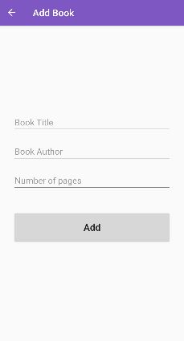
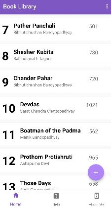
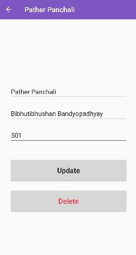
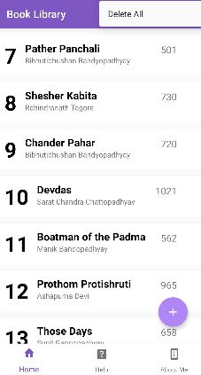
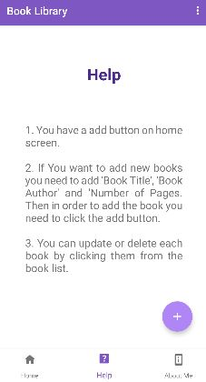

# Lipighor

## About Lipighor
Lipighor is a book storing application. Where you can add new books. You can also update and delete your books.

## Developed Using
* Programing Language: Java, XML
* OS: Android
* IDE: Android Studio

## Developed By
  Abir Chowdhury  
  Email: `achowdhury191254@bscse.uiu.ac.bd`  
  BSc in Computer Science and Engineering  
  United International University

## Features List

* The Features of `Lipighor` discussed below:
  * `Add Books`: You can add new book to book list.  
    
    
  
  * `Book List`: All of your book will be shown here.

    

  * `Update and Delete Books`: By clicking any book, you will be redirected to delete and update page and you can updade or delete books from here.

      
      
  * `Delete All`: All of your book will be deleted if you click Delete All.

     

  * `Help`: Here you can find how to use your app.

     
       
  * `About Me`: Here you can find information about me.

     

